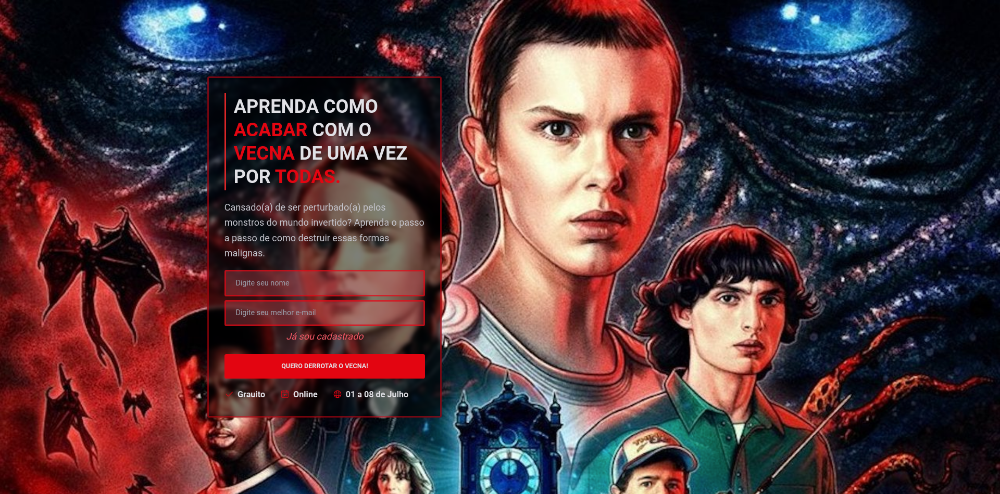
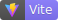
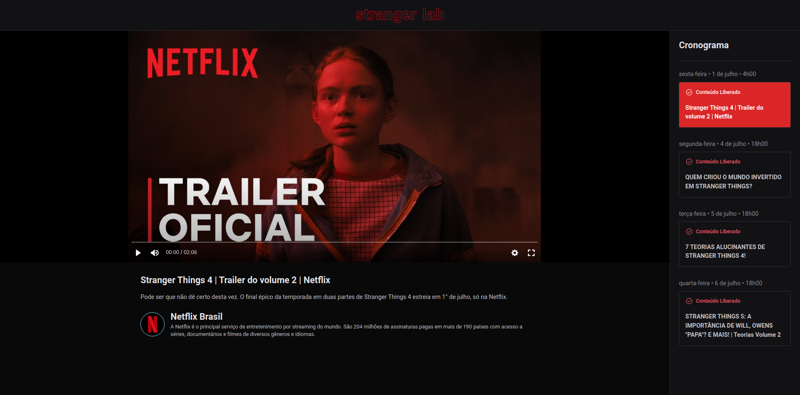

<h2 align="center">
   Stranger Lab - ReactJS | 
</h2>

<p align="center">





</p>

---

O **Stranger Lab** é uma aplicação desenvolvida com tema da série Stranger Things e com base no projeto desenvolvido durante o **Ignite Lab**, um dos eventos da Rocketseat.

Projeto foi hospedado na Vercel. Acesse o **Stranger Lab** desenvolvido [clicando aqui](https://stranger-lab.vercel.app/).

<p align="center">
  <a href="#-projeto">Projeto</a>&nbsp;&nbsp;&nbsp;|&nbsp;&nbsp;&nbsp;
  <a href="#-como-rodar-o-projeto">Como rodar o projeto</a>&nbsp;&nbsp;&nbsp;|&nbsp;&nbsp;&nbsp;
  <a href="#-extensões-vscode">Extensões VsCode</a>&nbsp;&nbsp;&nbsp;|&nbsp;&nbsp;&nbsp;
  <a href="#-tecnologias">Tecnologias</a>&nbsp;&nbsp;&nbsp;|&nbsp;&nbsp;&nbsp;
  <a href="#-licença">Licença</a>
</p>

## 💻 Projeto

A plataforma plataforma permite com que os usuários interessados façam sua inscrição para poder participar do evento e assistir aos vídeos.

Conforme for passando os dias dos eventos, novos vídeos vão sendo liberados.



## 🧭 Como rodar o projeto

**Clone este repositório**

```bash
git clone https://github.com/vitorsemidio-dev/stranger-lab.git
```

**Acesse a pasta**

```bash
cd ignite-lab
```

**Instale as dependências**

```bash
yarn
```

**Execute a aplicação**

```bash
yarn dev
```

## 🎉 Extensões VsCode

- [GraphQL](https://marketplace.visualstudio.com/items?itemName=GraphQL.vscode-graphql)
- [Tailwind CSS IntelliSense](https://marketplace.visualstudio.com/items?itemName=bradlc.vscode-tailwindcss)
- [PostCSS Language Support](https://marketplace.visualstudio.com/items?itemName=csstools.postcss)

## 🚀 Tecnologias

Esse projeto foi desenvolvido com as seguintes tecnologias:

- [Appolo](https://www.apollographql.com/)
- [GraphCMS](https://graphcms.com/)
- [GraphQL](https://graphql.org/)
- [ReactJS](https://pt-br.reactjs.org/)
- [Tailwind](https://tailwindcss.com/)
- [TypeScript](https://www.typescriptlang.org/pt/)
- [Vite](https://vitejs.dev/)

## 📝 Licença

Esse projeto está sob a licença MIT. Veja o arquivo [LICENSE](LICENSE) para mais detalhes.
